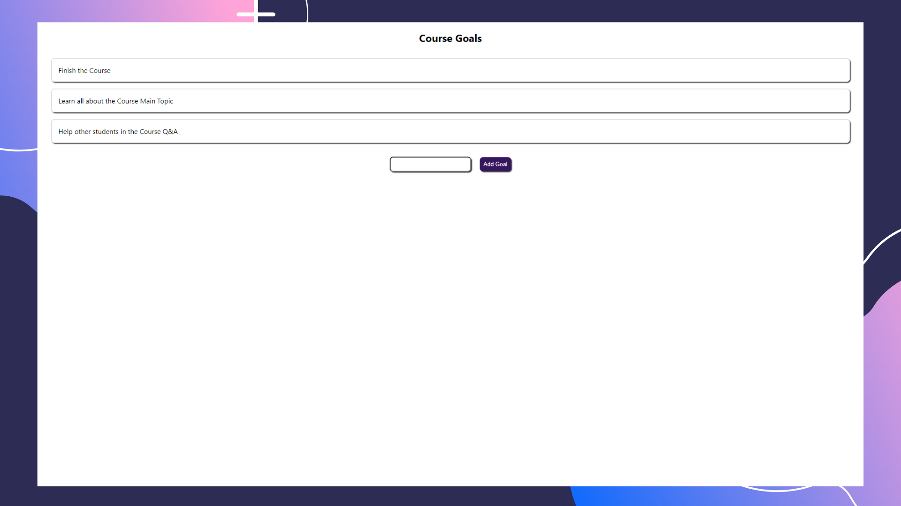

# Primeiro projeto feito com React

Primeira Aplicação em React, com conceitos básicos aproveitados no curso [React - The Complete Guide (incl Hooks, React Router, Redux)](https://www.udemy.com/course/react-the-complete-guide-incl-redux/)


## Conteúdo

É uma simples aplicação para testar conhecimentos básicos sobre criação de componentes, bem como uso de Hooks para alterar estados. Nesta aplicação, o usuário poderar adicionar Goals através do `input text`.  

## Imagens


### `Iniciando Aplicação:`

```
git clone https://github.com/alanhcrdz/goals-app
```

```
npm install
```
```
npm start
```

### `Este Projeto poderá ter atualizações`

<i>Desenvolvido por alanhcrdz</i>

<i>"Man cannot discover new oceans unless he has the courage to lose sight of the shore.</br>
Andre Gide"</i>
